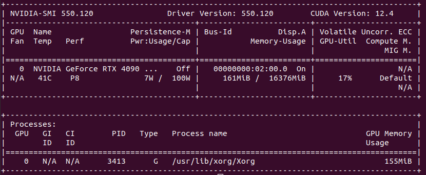
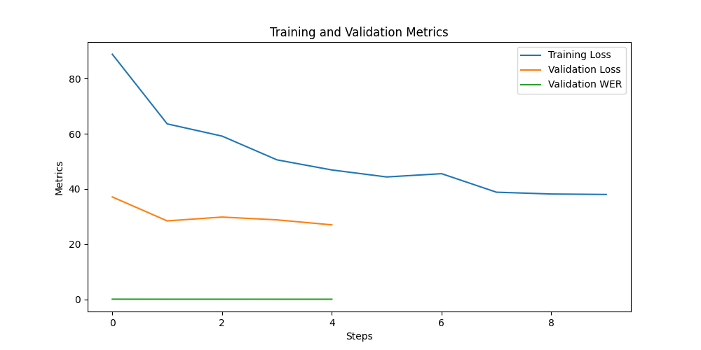

# **Training Report: Fine-Tuning Facebook Wav2Vec2-Large-960H on Common Voice Dataset**


## **1. Introduction**
This report documents the process of fine-tuning the pre-trained `facebook/wav2vec2-large-960h` model using the Common Voice dataset for automatic speech recognition (ASR). The purpose is to improve the accuracy of speech recognition for the dataset while exploring various training strategies.

---

## **2. Training Setup**
### **2.1 System Info** 
   Dump my system info using command `transformers-cli env` as followoing
   - `transformers` version: 4.38.0.dev0
   - Platform: Linux-6.8.0-49-generic-x86_64-with-glibc2.35
   - Python version: 3.10.14
   - Huggingface_hub version: 0.21.4
   - Safetensors version: 0.4.2
   - Accelerate version: 0.27.2
   - Accelerate config: 	not found
   - PyTorch version (GPU?): 2.2.1+cu121 (True)
   - Tensorflow version (GPU?): not installed (NA)
   - Flax version (CPU?/GPU?/TPU?): not installed (NA)
   - Jax version: not installed
   - JaxLib version: not installed
   - Using GPU in script?: **Yes**
   - Using distributed or parallel set-up in script?: **parallel**

     My GPU Info:
   

### **2.2 Dataset Description**
- **Source**: Common Voice dataset 
   - Version: Download from shared zip
   - Language English
- **Audio Files & Text Annotations**: After data processing filter
   - Train dataset length: **136747**
   - Validation dataset length: **58619**

### **2.3 Model Details**
- **Pre-trained Model**: `facebook/wav2vec2-large-960h`
- **Fine-tuning Objective**: CTC (Connectionist Temporal Classification)

### **2.4 Training Configuration**
- **Batch Sizes**:
  - Training: 4
  - Evaluation: 4
  - gradient_accumulation_steps=2 : # Simulates doubling the batch size 
- **Learning Rate**: 2e-5
- **Number of Epochs**: 3
- **Loss Function**: CTC Loss
- **Optimization**: AdamW optimizer with weight decay 0.01.
- **Precision**: Mixed precision (FP16).
- **Checkpointing**: Models were saved every 500 steps(to change it if dirserd), with a maximum of 2 checkpoints retained.
- **Evaluation**: Validation set evaluated every 100 steps(to change it if dirserd) using Word Error Rate (WER) as the primary metric.
- **freeze encoder** `model.freeze_feature_encoder()`

### **2.5 Training Process**
- Model initialization: Pre-trained weights from `facebook/wav2vec2-large-960h`.
- Dynamic padding and sequence truncation to handle variable-length inputs and labels.
- Training logs captured for loss metrics and evaluation results.

---

## **3. Training Data Processing**

### **3.1 Data Preprocessing**
- **Text Normalization**:
  - Characters to ignore: `r'[\,\?\.\!\-\;\:\"]'`
  - Uppercase conversion and whitespace trimming.
- **Audio Preprocessing**:
  - Sampling rate: Resampled to 16kHz using `torchaudio.transforms.Resample`.
  - Duration Filtering: Retained files with durations between **1.0** and **15.0** seconds.
  - Remove **empty** Text Annotations
- **Data Splits**:Split into train and validation sets 
  - Training Set: 70% of total dataset length
  - Validation Set: 30% of total dataset length


### **3.2 Dataset Chunks & Caching**
**Processed datasets**: were cached in chunks (e.g., 10,000 samples per chunk) to reduce redundant computation and enable efficient reloading during training.
- Training data is split into smaller chunks of size for processing and saving individually.
- Use a generator-based approach instead of apply to avoid creating large intermediate objects.
Process and append data to a list in chunks to minimize memory usage.
- Each chunk is cached in a separate directory (part_1, part_2, ... etc.) under cache dir.

### **3.3 Load dataset from cache**
- Load all cached parts for the train_dataset,  concatenate them into one dataset
- Repeat the above step for the val_dataset 
 - **Load datset**:
   
   ```bash
   Loading dataset from disk: 100%|███████████████████████████████████| 24/24 [00:00<00:00, 42189.14it/s]
   ...
   Loading dataset from disk: 100%|███████████████████████████████████| 24/24 [00:00<00:00, 11026.76it/s]
   Concatenated 14 parts for train dataset.
 
   Loading dataset from disk: 100%|███████████████████████████████████| 24/24 [00:00<00:00, 37518.93it/s]
   ...
   Loading dataset from disk: 100%|███████████████████████████████████| 23/23 [00:00<00:00, 12151.28it/s]
   Concatenated 6 parts for val dataset.
   Train dataset length: 136747
   Validation dataset length: 58619
   ```
---

## **4. Training Experiments**

### **4.1 Hit Excessive Memory Usage issue**
**excessive memory usage** encountered when processing the full training datasets, my host has memory(32GB). And here are the fixes as follows: 
- Chunk the dataset into smaller chunks of size train_chunk_size for processing and saving individually.
- Use a generator-based approach instead of apply to avoid creating large intermediate objects.
Process and append data to a list in chunks to minimize memory usage.
- Cache the chunked data into multi-parts
- Load and concatenate them into one dataset before training

### **4.2 Hit WER Rate was 1.0**
The training WER was alway **1.0** caught my eyes at the end of first run of full-dataset training.

#### **Steps to Trouble Shooting**     
1. Debugging and Printing in **compute_metrics**, to confirm nothing wrong with the code implementation 
   ```bash
   print(f"Sample Prediction[{random_index}]: {pred_str[random_index]}")
   print(f"Sample Reference[{random_index}]: {label_str[random_index]}")
   ```
2. Debugging and Printing for **tokenizer** and **DataCollatorCTCWithPadding**,  to confirm nothing wrong with the code
   - Printed out the **processor.tokenizer** vocabulary value: 

   ```bash
   {'<pad>': 0, '<s>': 1, '</s>': 2, '<unk>': 3, '|': 4, 'E': 5, 'T': 6, 'A': 7, 'O': 8, 'N': 9, 'I': 10, 'H': 11, 'S': 12, 'R': 13, 'D': 14, 'L': 15, 'U': 16, 'M': 17, 'W': 18, 'C': 19, 'F': 20, 'G': 21, 'Y': 22, 'P': 23, 'B': 24, 'V': 25, 'K': 26, "'": 27, 'X': 28, 'J': 29, 'Q': 30, 'Z': 31}
   ```
3. Isolate the issueu seems from processed Dataset 
   
   Further **Exam the Dataset** and print out a Sample as following:
   ```bash
   Sample Text:  `an army is coming the boy said`
   Tokenized text:  [3, 3, 4, 3, 3, 3, 3, 4, 3, 3, 4, 3, 3, 3, 3, 3, 3, 4, 3, 3, 3, 4, 3, 3, 3, 4, 3, 3, 3, 3, -100, -100, -100, -100, -100, -100, -100, -100, -100, -100, -100, -100, -100, -100, -100, -100, -100, -100, -100, -100, -100, -100, -100, -100, -100, -100, -100, -100, -100, -100, -100, -100, -100, -100, -100, -100, -100, -100, -100, -100, -100, -100, -100, -100, -100, -100, -100, -100, -100, -100, -100, -100, -100, -100, -100, -100, -100, -100, -100, -100, -100, -100, -100, -100, -100, -100, -100, -100, -100, -100, -100, -100, -100, -100, -100, -100, -100, -100, -100, -100, -100, -100, -100, -100, -100, -100, -100, -100, -100, -100, -100, -100, -100, -100, -100, -100, -100, -100, -100, -100, -100, -100, -100]

   Decoded text: 
   ```
4. **Identify** The Issue 

  - Exam the printing in step 3 above, the **Tokenized text**, all characters were encoded to 3("unk") and 4(white space)
  - **Root cause**: Somehow, I accidently converted the text to lower case in **normalize_text**, however, the model is expected in upper case printed out in the **vocabulary** above:
   ```bash
      def normalize_text(batch):
         batch["text"] = re.sub(chars_to_ignore_regex, '', batch["text"]).lower().strip()
         return batch
   ```
5. The **Fixes**, change the line to **upper case** and the correct value shows out as following: 
     ```bash
   Sample Text:  `AN ARMY IS COMING THE BOY SAID`
   Tokenized text: [7, 9, 4, 7, 13, 17, 22, 4, 10, 12, 4, 19, 8, 17, 10, 9, 21, 4, 6, 11, 5, 4, 24, 8, 22, 4, 12, 7, 10, 14, -100, -100, -100, -100, -100, -100, -100, -100, -100, -100, -100, -100, -100, -100, -100, -100, -100, -100, -100, -100, -100, -100, -100, -100, -100, -100, -100, -100, -100, -100, -100, -100, -100, -100, -100, -100, -100, -100, -100, -100, -100, -100, -100, -100, -100, -100, -100, -100, -100, -100, -100, -100, -100, -100, -100, -100, -100, -100, -100, -100, -100, -100, -100, -100, -100, -100, -100, -100, -100, -100, -100, -100, -100, -100, -100, -100, -100, -100, -100, -100, -100, -100, -100, -100, -100, -100, -100, -100, -100, -100, -100, -100, -100, -100, -100, -100, -100, -100, -100, -100, -100, -100, -100]

   Decoded text: `AN ARMY IS COMING THE BOY SAID<unk>`
   ```
 
### **4.3 Hit CUDA out of Memory**
   I encountered a **CUDA Out of Memory (OOM)** issue, which occurs when GPU does not have enough free memory to allocate additional resources for the training step shown as following log.
  ```bash
   Setting up training arguments...
   Initializing Trainer...
   Starting training...
   0%|                                                                      | 0/102561 [00:00<?, ?it/s]Training started
   ...

   result = tensor1.new_full(new_shape, padding_index)
   torch.cuda.OutOfMemoryError: CUDA out of memory. Tried to allocate 4.99 GiB. GPU 0 has a total capacity of 15.70 GiB of which 4.99 GiB is free. Including non-PyTorch memory, this process has 10.69 GiB memory in use. Of the allocated memory 8.63 GiB is allocated by PyTorch, and 1.75 GiB is reserved by PyTorch but unallocated. If reserved but unallocated memory is large try setting PYTORCH_CUDA_ALLOC_CONF=expandable_segments:True to avoid fragmentation.  See documentation for Memory Management  (https://pytorch.org/docs/stable/notes/cuda.html#environment-variables)
   0%|          | 100/102561 [29:34<505:03:32, 17.75s/it]  
   ```
### **Steps to Resolve OOM Error**
1. **Reduce `per_device_train_batch_size`:**
   The batch size is a major contributor to memory usage. Halve the value in the `TrainingArguments`:
   ```python
   per_device_train_batch_size=8,
   per_device_eval_batch_size=8,
   ```
   If necessary, reduce further to `4` or even `2`.

2. **Enable Gradient Accumulation:**
   Use smaller batches and accumulate gradients to simulate a larger effective batch size:
   ```python
   gradient_accumulation_steps=2,  # Simulates doubling the batch size
   ```
   This splits the batch across multiple forward passes, reducing memory demand.

3. **Use Mixed Precision Training:**
   Enable mixed precision training to reduce memory usage:
   ```python
   fp16=True,
   ```
   This works well if your GPU supports Tensor Cores (NVIDIA Volta and later).

4. **Clear GPU Memory:**
   Ensure no other processes are using GPU memory before training:
   - Check running processes:
     ```bash
     nvidia-smi
     ```
   - Kill unwanted processes:
     ```bash
     kill -9 <process_id>
     ```

5. **Restrict GPU Usage:**
   Limit the script to specific GPUs with more available memory:
   ```bash
   CUDA_VISIBLE_DEVICES=1 python training-cv.py
   ```

6. **Optimize the Model:**
   - Use model checkpoints with lower memory requirements.
   - Reduce the sequence length if applicable:
     ```python
     max_length=256,  # Or a smaller value based on your dataset
     ```

7. **Set CUDA Environment Variable:**
   Enable dynamic memory management to prevent fragmentation:
   ```bash
   export PYTORCH_CUDA_ALLOC_CONF=expandable_segments:True
   ```

8. **Use Multi-GPU Training:**

   Distribute the workload across multiple GPUs if available:
   ```bash
      CUDA_VISIBLE_DEVICES=0,1 python -m torch.distributed.launch --nproc_per_node=2 train-cv.py
   ```

---

## **5. Results**
Training the full dataset takes approximately 10 hours on my current setup, which is extremely time-consuming, especially with lower hardware configurations. After encountering Word Error Rate (WER) issues during the initial full-dataset training, I decided to use only 10% (to set `LIMIT_TRAIN_DATASET = True`)of the total dataset for the second training attempt. The results are as follows:


### **5.1 Metrics**
```bash
***** train metrics *****
  epoch                    =        3.0
  train_loss               =    51.0153
  train_runtime            = 1:06:09.07
  train_samples            =      13674
  train_samples_per_second =     10.335
  train_steps_per_second   =      1.292
```

### **5.2 Training Result**

Here is the training result from the logged [training_log.csv](./asr-train/training_log.csv)
:

|   epoch   | train_loss |         eval_loss         |         eval_wer          |
|-----------|------------|--------------------------|---------------------------|
|  0.292483 |  88.7678   |          None            |          None             |
|  0.584966 |  63.5604   |          None            |          None             |
|  0.584966 |    None    |  37.10172653198242       |  0.08617345031945754      |
|  0.877450 |  59.1292   |          None            |          None             |
|  1.169933 |  50.5406   |          None            |          None             |
|  1.169933 |    None    |  28.435426712036133      |  0.07506807382227838      |
|  1.462416 |  46.8760   |          None            |          None             |
|  1.754899 |  44.3462   |          None            |          None             |
|  1.754899 |    None    |  29.818138122558594      |  0.07423161116944597      |
|  2.047382 |  45.5298   |          None            |          None             |
|  2.339865 |  38.8243   |          None            |          None             |
|  2.339865 |    None    |  28.807701110839844      |  0.06930182064105074      |
|  2.632349 |  38.1703   |          None            |          None             |
|  2.924832 |  38.0019   |          None            |          None             |
|  2.924832 |    None    |  27.004287719726562      |  0.06588478171884177      |
|  2.999123 |    None    |          None            |          None             |

- And the result plot is as follows:



### **5.3 Observations**
#### Training Loss:
- **Trend**: The training loss decreases consistently over the epochs, starting from **88.77** and reducing to **38.00** by epoch 2.92.
- **Observation**: This suggests that the model is learning and improving its ability to fit the training data as the epochs progress.

---

#### Validation Loss:
- **Trend**: The validation loss also decreases over time, starting from **37.10** in the first evaluation (epoch 0.58) to **27.00** in the final evaluation (epoch 2.92).
- **Observation**: This indicates that the model's performance on unseen data is improving over time.

---

#### Word Error Rate (WER):
- **Trend**: The WER shows a steady decline, starting from **0.0861** (8.61%) at epoch 0.58 to **0.0658** (6.58%) at epoch 2.92.
- **Observation**: This is a clear indication that the model is becoming better at predicting and aligning text outputs with the expected ground truth over time.

#### Performance comparison Orignal model `facebook/wav2vec2-large-960h` Vs `Fine-tuned` model by Error Rate (WER):


```bash
   $ cd xxx/JohnL-handsOn/asr-train

   $python task4_performance_compare.py  -csv "../../common_voice/cv-valid-test.csv" -audio "../../common_voice/cv-valid-test" 
```
**Noted**, change the `-csv` and `-audio` path to your actual one

It will print out the WER as follows:

```bash
   Orignal model perfromance:
      Overall WER: 10.82%
   Fine-tuned model performance:
      Overall WER: 7.32%
```

---


## **6. Summary and Recommendations**

### **6.1 Summary**

- **Consistent Improvement**: The training loss, validation loss, and WER all show a decreasing trend, reflecting effective model training and validation.
- **No Overfitting**: There is no evidence of overfitting since both training and validation metrics are improving.
- **Performance**: The declining WER highlights that the model's transcription accuracy is progressively improving.

### **6.2 Recommendations for Improvement**
### Recommendations for Improvement

Here are actionable recommendations to further enhance the model's performance based on the training results:
1. **Data Augmentation**:
   - **Techniques**: Introduce variations in the input data such as speed perturbation, volume scaling, or noise injection to improve the model's robustness.
   - **Impact**: This can help the model generalize better, especially in diverse real-world scenarios.

2. **Hyperparameter Tuning**:
   - **Learning Rate**: Experiment with different learning rate schedules like cosine annealing or cyclic learning rates to achieve more stable convergence.
   - **Batch Size**: Test larger batch sizes to improve gradient estimates or smaller batch sizes for finer updates, depending on hardware constraints.
   - **Warmup Steps**: Adjust the number of warmup steps to balance between fast convergence and stability.

3. **Model Architecture**:
   - **Transformer-based Models**: Fine-tune transformer-based architectures (e.g., Wav2Vec 2.0 or HuBERT) for potential performance gains in WER.
   - **Language Models**: Incorporate external language models for post-processing predictions, improving contextual understanding.

4. **Additional Pre-Training**:
   - **Domain-Specific Data**: Use unannotated domain-specific audio for pre-training before fine-tuning. This can help the model adapt better to specific use cases.
   - **Multilingual Training**: If applicable, include diverse datasets to improve cross-linguistic generalization.

5. **Regularization**:
   - **Dropout**: Apply dropout layers to prevent overfitting, especially as the training and validation losses approach similar values.
   - **Label Smoothing**: Introduce label smoothing to make the model more tolerant of uncertainty in predictions.
   - **Weight Decay**: Regularize weights to prevent excessively large updates.

6. **Evaluation and Metrics**:
   - **Fine-Grained Evaluation**: Analyze WER on subsets of data (e.g., noisy vs. clean audio, different speakers) to identify specific areas for improvement.
   - **Validation Strategy**: Increase the frequency of validation during training to monitor overfitting trends more closely.

7. **Training Data Optimization**:
   - **Balanced Sampling**: Ensure an even representation of different classes or speaker accents in the dataset.
   - **Data Pruning**: Remove or fix low-quality samples that could negatively affect model training.

8. **Longer Training Duration**:
   - Extend the training to more epochs or iterations, leveraging early stopping to determine the optimal stopping point for model performance.

---

## **7. Conclusion**

The training process demonstrated effectiveness, evidenced by the steady decline in both training and validation losses across epochs. The alignment of the decreasing validation loss with the training loss suggests an absence of immediate overfitting, indicating the model's ability to generalize well to unseen data. Furthermore, the consistent improvement in Word Error Rate (WER) reinforces the model's progress in learning and achieving better speech recognition accuracy.

This experiment establishes a strong foundation for further advancements in training speech recognition models on the Common Voice dataset. Future iterations will prioritize implementing the recommended strategies, such as data augmentation, hyperparameter tuning, and leveraging advanced model architectures, to refine and enhance performance.

---

## **8. References**
- Common Voice Dataset Documentation
- Transformers Library Documentation
- [Fine-tuning Wav2Vec2 for English ASR](https://colab.research.google.com/github/patrickvonplaten/notebooks/blob/master/Fine_tuning_Wav2Vec2_for_English_ASR.ipynb#scrollTo=e335hPmdtASZ)].


